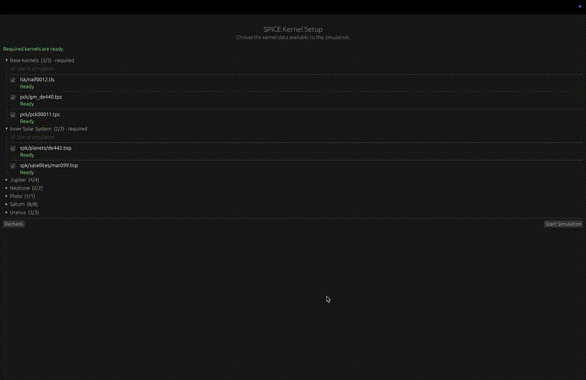
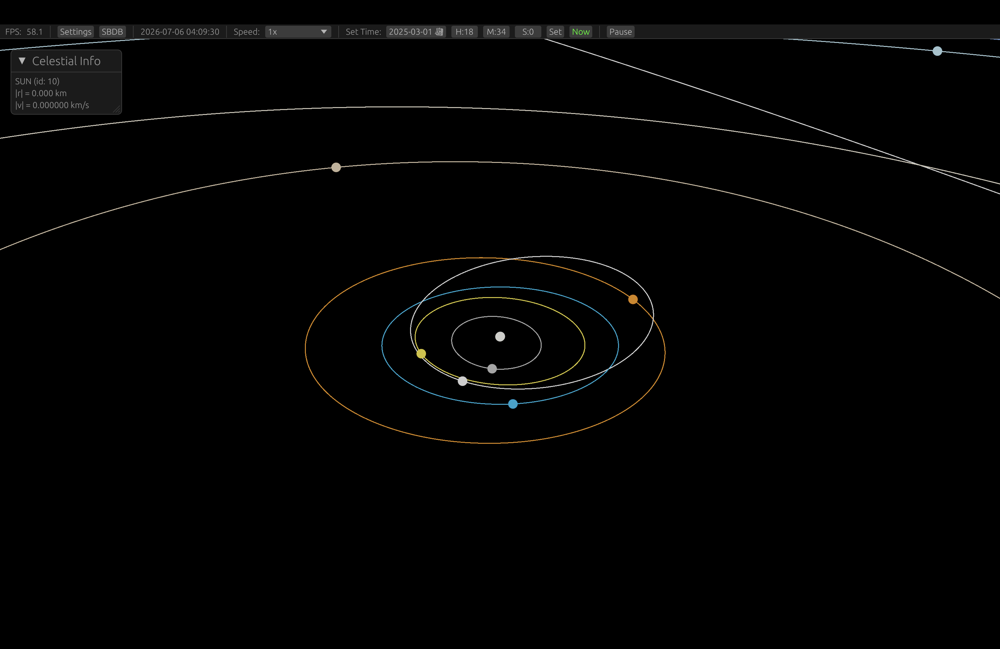
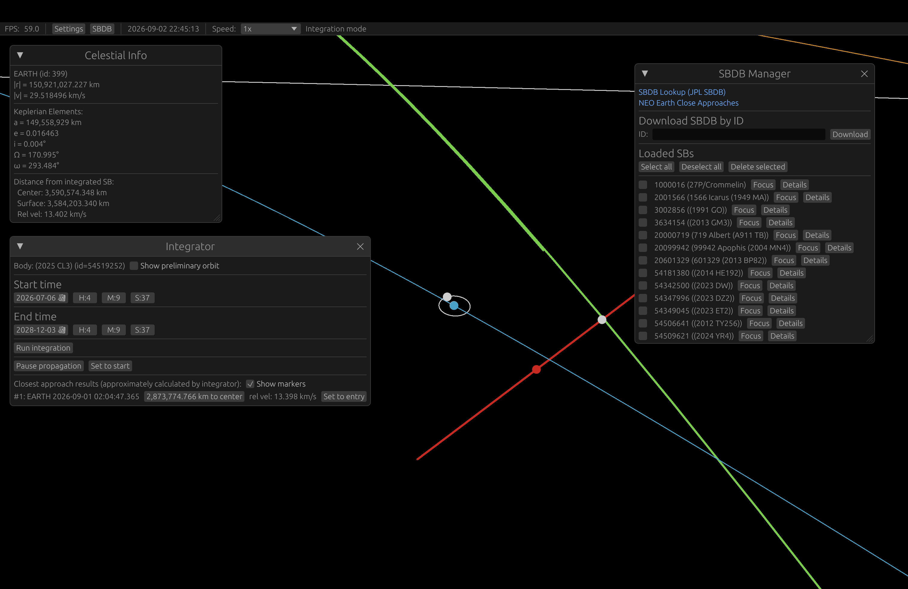

# AXbit

**AXbit is an experimental visual astrodynamics lab** for SPICE/SBDB-based solar-system exploration, small-body trajectories, and close-approach visualization. It is designed for visualization, exploration, and validation-assisted experimentation.

<p align="center">
<a href="#key-features"><strong>Features</strong></a> •
<a href="#screenshots"><strong>Screenshots</strong></a> •
<a href="#quick-start"><strong>Quick Start</strong></a> •
<a href="#documentation"><strong>Documentation</strong></a> •
<a href="#contributing"><strong>Contribute</strong></a> •
<a href="#roadmap"><strong>Roadmap</strong></a>
</p>

<p align="center">
<!--
https://shields.io/
-->
<a href="LICENSE"></a>
<a href="https://github.com/axneo27/AXbit/issues"></a>
</p>

> [!IMPORTANT]
> **Project Status:** This project is an early-stage research and visualization tool. It is useful for exploration and validation-assisted experimentation, but it should **not** be treated as an operational navigation, hazard assessment, or mission-design system. The visuals are also currently basic — bodies are rendered as shaded spheres — the priority so far has been the underlying physics and data pipeline, not visual fidelity.

## Key Features

- **Small-body trajectory propagation** and close-approach analysis.
- **SPICE-based ephemerides** for precise solar-system geometry.
- **Interactive 3D visualization** of trajectory geometry and scenarios.
- Built with **Rust** and `wgpu` for shader-based 3D rendering.

## Screenshots

<div align="center">
  
</div>


<div align="center">
  
  
</div>

## Quick Start

AXbit is a visual application. Before running it, you need the CSPICE toolkit in place:

1. Download the CSPICE toolkit (C version) from the [NAIF website](https://naif.jpl.nasa.gov/naif/toolkit_C.html).
2. Extract it and place the `cspice` directory inside this repo's `spice-tools/` folder.
3. Then clone and run:

```bash
git clone https://github.com/axneo27/AXbit.git
cd AXbit
cargo run
```

SPICE *kernels* (the data files, separate from the CSPICE toolkit itself) aren't bundled with the repo. You can fetch them from within the app itself, or download them manually — see the [Kernels Guide](docs/KERNELS.md) for details.

For notes on numerical methods and their limitations, see [Accuracy & Limitations](docs/ACCURACY.md).

> [!NOTE]
> **Platform support:** So far this has only been built and run on macOS (Apple Silicon). It hasn't been tested on Windows or Linux yet — if you try either, feedback is welcome.

## Documentation

For more in-depth information, please refer to the documentation in the `docs/` folder:

- [Kernels](docs/KERNELS.md)
- [Accuracy and limitations](docs/ACCURACY.md)

## Roadmap

AXbit is young, and there's a lot of open room here — both in rigor and in creativity. Rough priorities, from nearest-term to more speculative:

**Near future**
- Fixing what's currently broken or rough around the edges.
- Improving integrator accuracy: adding missing force models and validating the ones already in place.
- Real barycentric reference frame support — currently a placeholder, not yet a proper implementation.
- Review the logic and architecture on kernels, time_bounds, and make it easier for usage.
- Not urgent or 100% needed - consider switching to glam.

**Physics & accuracy**
- Relativistic effects.
- Spherical harmonics for non-spherical gravity fields.
- Solar radiation pressure in the integrator.
- Accuracy showcases validated against real NASA data.
- ReboundX?

**Data & simulation**
- Better kernel/SBDB management: updates, refresh workflows, and general lifecycle handling.
- A Monte Carlo simulation system with visualization, using covariance matrices pulled from SBDB objects via the API.

**Further out**
- Exploratory work on deep-space mission design — DART-like scenarios for approaching asteroids and altering their trajectories, using custom algorithms and possibly neural networks.

None of this is fixed in stone — if you have ideas that fit the spirit of the project, they're welcome.

## Contributing

Initially, this is a personal project, but contributions and feedback are welcome. See [CONTRIBUTING.md](CONTRIBUTING.md) for how to get started.

## Built With

- **Rust** — core language for the project.
- **CSPICE** — NASA's toolkit for planetary ephemerides and geometry.
- **wgpu, egui & winit** — 3D rendering and UI.
- **cgmath** — math/linear algebra (primary), with **nalgebra** used alongside it.
- **ode_solvers** — numerical integration.
- **reqwest** — fetching SBDB data.
- **rusqlite** — caching fetched SBDB objects locally.

## Acknowledgments

AXbit uses the NASA/JPL SPICE toolkit (CSPICE) and NASA/JPL Small-Body Database (SBDB) data. We acknowledge the NAIF/SPICE team and the SBDB maintainers for their foundational work.

## License

This project is licensed under the Apache License 2.0. See the [LICENSE](LICENSE) file for details.